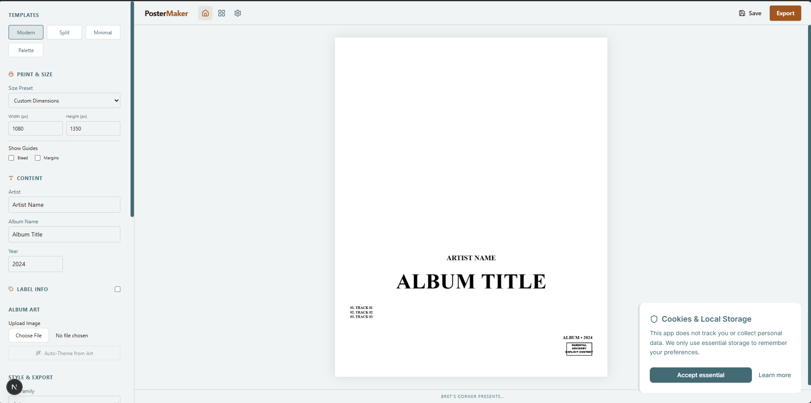

# PosterMaker

A professional, privacy-first web application for designing iconic album posters. Create print-ready artwork directly in your browser with zero data collection.



## Features

-   **Smart Templates**: Modern, Split, and Minimal layouts that auto-adapt to your content.
-   **Auto-Theming**: Automatically extracts color palettes from your uploaded album artwork.
-   **Print Ready**:
    -   Presets for A4, A3, A2, Letter, Tabloid, and Square sizes.
    -   300 DPI export support.
    -   Professional bleed and margin guides.
-   **Advanced Typography**: Curated font selection with fine-grained control over size, spacing, and alignment.
-   **Privacy First**:
    -   100% Client-side processing.
    -   No server uploads.
    -   No tracking or analytics.
    -   Designs saved locally to your device.

## Tech Stack

-   **Framework**: Next.js 15 (App Router)
-   **UI**: React 19, TailwindCSS, Lucide Icons
-   **Canvas**: Fabric.js 6+
-   **State**: Zustand + Persistence
-   **Export**: jsPDF, Canvas API

## Getting Started

1.  Clone the repository:
    ```bash
    git clone https://github.com/bretscorner/poster-maker.git
    ```
2.  Install dependencies:
    ```bash
    npm install
    ```
3.  Run the development server:
    ```bash
    npm run dev
    ```
4.  Open [http://localhost:3000](http://localhost:3000) with your browser.

## Privacy Policy

We believe in software that respects your privacy.
-   **No Data Collection**: We do not collect personal usage data.
-   **Local Processing**: All image manipulation happens in your browser's memory.
-   **Local Storage**: Your work is saved to your browser's Local Storage so you can resume later.

## License

MIT License. Free to use and modify.
